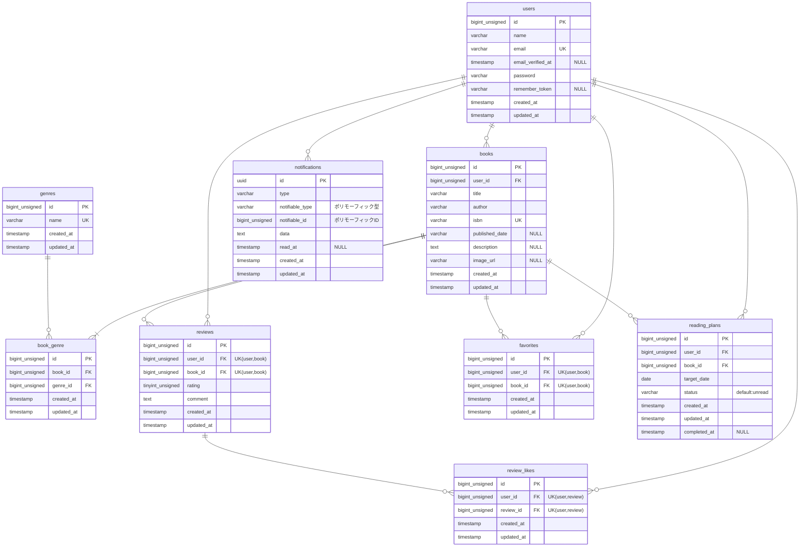

# 模擬案件\_書籍レビューアプリ BookShelf

## プロジェクト概要

本プロジェクトは、お気に入りの書籍を管理し、レビューや読書計画の作成、レポート集計、期日通知を行うことができる「書籍レビュー管理システム（BookShelf）」です。
標準的なWeb画面機能（Laravel Breeze）に加え、外部API（Google Books API）を用いたISBN書籍検索や、日次バッチ処理（Artisanコマンド）による期限切れ読書計画の自動失効、Laravel Sanctumを用いたモバイルアプリ・外部連携向けのセキュアなAPIトークン認証基盤（v1）を網羅した、堅牢なバックエンドシステムとして構築されています。

## 作成者

- gomashio-no-omusubi

## 使用技術（実行環境）

- **PHP**: 8.2.x（※スプレッドシート指定要件: 8.5 / Laravel Sail標準環境の実態に準拠）
- **Laravel**: 10.x（明示的指定による構築）
- **MySQL**: 8.0.x（※スプレッドシート指定要件: 8.4 / Laravel Sail明示指定コンテナの実態に準拠）
- **nginx**: 1.25.x / Sail内蔵環境
- **フロントエンド**: Vite, Tailwind CSS ^3.4.0, @tailwindcss/forms, Alpine.js
- **開発ツール**: Docker, Laravel Sail, phpMyAdmin

## 開発環境アクセスURL

- **書籍一覧画面（トップ）** : http://localhost/
- **会員登録画面** : http://localhost/register
- **ログイン画面** : http://localhost/login
- **phpMyAdmin** : http://localhost:8080/

## ER図



## APIエンドポイント一覧

本システムが提供している外部アプリケーション向け公開API（JSON）の仕様一覧です。
スプレッドシートの仕様に準拠し、基礎段階の挙動（認証不要）を残しつつ、応用段階として書き込み系リクエスト（POST/PUT/DELETE）に対して Laravel Sanctum によるAPIトークン認証およびポリシー認可（BookPolicy）を徹底しています。

| HTTPメソッド | URI                    | 説明               | 認証 | 認証（応用）                           |
| :----------- | :--------------------- | :----------------- | :--- | :------------------------------------- |
| **GET**      | `/api/v1/books`        | 書籍一覧を取得する | 不要 | 不要                                   |
| **GET**      | `/api/v1/books/{book}` | 書籍詳細を取得する | 不要 | 不要                                   |
| **POST**     | `/api/v1/books`        | 書籍を新規登録する | 不要 | **★Sanctum 必須**                      |
| **PUT**      | `/api/v1/books/{book}` | 書籍を更新する     | 不要 | **★Sanctum + BookPolicy (所有者のみ)** |
| **DELETE**   | `/api/v1/books/{book}` | 書籍を削除する     | 不要 | **★Sanctum + BookPolicy (所有者のみ)** |

### 🔑 認証ヘッダー仕様（応用リクエスト時）

応用段階の認証必須エンドポイント（`POST/PUT/DELETE`）へアクセスする際は、リクエストヘッダーに必ず以下を含めて通信を行ってください。

```http
Authorization: Bearer <発行したAPIトークン>
Accept: application/json
```

---

## 開発環境構築手順

本プロジェクトをローカル環境にクローンし、Laravel Sailを用いてアプリケーションを起動する手順です。  
_※ Windows環境をお使いの方は、必ず `WSL（Ubuntu）` のターミナルで実行してください（`PowerShell` では動きません）。_

### 1. リポジトリのクローンとディレクトリ移動

任意の作業ディレクトリで以下を実行し、プロジェクトディレクトリへ移動します。

#### 1-1. リポジトリをクローン

```bash
git clone git@github.com:gomashio-no-omusubi/bookshelf-app.git
```

#### 1-2. 作成したディレクトリに移動

```bash
cd bookshelf-app
```

### 2. 各種依存ライブラリの一括インストール (Composer)

Docker（一時コンテナ）経由で、プロジェクトに必要なLaravelの実行パッケージ（Breeze, Sanctum等含む）を一括インストールします。

```bash
docker run --rm \
    -u "$(id -u):$(id -g)" \
    -v "$(pwd):/var/www/html" \
    -w /var/www/html \
    laravelsail/php82-composer:latest \
    composer install
```

### 3. 環境設定ファイル (.env) の作成と確認

提供されている雛形をコピーして `.env` ファイルを作成します。

```bash
cp .env.example .env
```

#### 3-1. データベース接続情報の設定確認

`.env` ファイルを開き、データベースの接続情報が以下（スプレッドシート指定値）と一致していることを確認・変更してください。

```env
DB_CONNECTION=mysql
DB_HOST=mysql
DB_PORT=3306
DB_DATABASE=laravel
DB_USERNAME=sail
DB_PASSWORD=password

# 外部API連携設定（Google Books API）
GOOGLE_BOOKS_API_KEY=dummy_key_value
```

> **【重要】** `DB_HOST` には `localhost` や `127.0.0.1` ではなく、必ずDockerのコンテナ名である `mysql` 指定してください。

### 4. アプリケーションキーの生成

暗号化に必要なアプリケーションキーを生成します。

```bash
docker run --rm \
    -u "$(id -u):$(id -g)" \
    -v "$(pwd):/var/www/html" \
    -w /var/www/html \
    laravelsail/php82-composer:latest \
    php artisan key:generate
```

### 5. Laravel Sail の起動とエイリアス設定

#### 5-1. Sailをバックグラウンドで起動

```bash
./vendor/bin/sail up -d
```

_※ **M1/M2/M3 Mac (Apple Silicon) をお使いの方へ**：`sail up -d` 実行時にエラーが発生する場合は、`compose.yaml` を開き、 `mysql` サービスに `platform: 'linux/amd64'` が追加されていることを確認した上で再度実行してください。_

#### 5-2. エイリアスを設定

毎回 `./vendor/bin/sail` と入力するのは避けるため、エイリアスを設定して `sail` だけで実行可能にします。

```bash
# Zsh (Mac) の場合
echo "alias sail='[ -f sail ] && bash sail || bash vendor/bin/sail'" >> ~/.zshrc
exec $SHELL

# Bash (Linux/WSL) の場合
echo "alias sail='[ -f sail ] && bash sail || bash vendor/bin/sail'" >> ~/.bashrc
exec $SHELL
```

### 6. フロントエンドのセットアップ (Vite & Tailwind CSS)

すでに設定済みのTailwind CSSおよびViteの環境をビルドします。

```bash
# パッケージのインストール
sail npm install

# フロントエンドのビルド
sail npm run build
```

_※ デザインをリアルタイムで反映させながら開発を行う場合は、別途 `sail npm run dev` を実行してください。_

### 7. データベースのマイグレーションと初期データ投入

アプリケーションを動作させる環境（開発環境）と、PHPUnitを実行する環境（テスト環境）のそれぞれでマイグレーションを行います。

#### 7-1. 開発環境用のマイグレーション

```bash
# 既存のデータベースを完全にリセットして再構築・シード投入
sail artisan migrate:fresh --seed
```

#### 7-2. テスト環境用のマイグレーション（PHPUnit用）

```bash
# テスト環境のデータベースを初期化し、シードを投入
sail artisan migrate:fresh --env=testing --seed
```

#### 7-3. テストの実行

環境構築が正常に完了したかを確認するため、以下のコマンドですべてのテストが **PASS** することを確認してください。

```bash
sail artisan test
```

### 📋 本プロジェクトの組み込み済み仕様（自動で適用されます）

以下の機能・基盤はすべてリポジトリ内に実装が完了しているため、上記の基本環境構築手順（`composer install` および `migrate:fresh --seed`）を実行するだけで、追加の操作なしで自動的にセットアップが完了します。

- **日本語化対応 (バリデーション・認証メッセージ)**
    - `config/app.php` の `locale` を `ja` に設定し、`lang/ja/` にメッセージファイルを手動配置しています。
    - **【セキュリティ対策】** 外部の `laravel-lang/*` 系パッケージは一切導入せず、安全な手動管理を行っています。
- **API認証基盤 (Laravel Sanctum)**
    - 応用フェーズ用のAPIトークン認証（Sanctum）の依存関係、設定ファイル、マイグレーションはすべてプロジェクト内に組み込み済みです。
- **外部API連携 (Google Books API)**
    - ISBN検索機能のための基盤設計（`config/services.php` 経由の集中管理）が組み込まれています。`.env` の `GOOGLE_BOOKS_API_KEY` を読み込んで安全に動作します。
